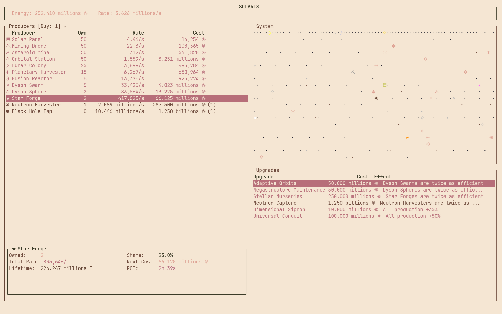

# Solaris ☀️

[](LICENSE)

A terminal-based idle game where you harness the power of the cosmos to generate infinite energy—from humble solar panels to universe-creating catalysts.



## Table of Contents

- [Features](#features)
- [Quick Start](#quick-start)
- [Documentation](#documentation)
- [Controls](#controls)
- [Contributing](#contributing)
- [Tech Stack](#tech-stack)
- [License](#license)

## Features

- **20 Producer Types** — Progress from Solar Panels to Big Bang Catalysts
- **474 Upgrades** — Producer, synergy, global, manual, and specialty upgrades
- **260 Achievements** — Track your cosmic accomplishments
- **100 Prestige Upgrades** — Ascend to earn Stellar Chips and permanent bonuses
- **Thousand Rays System** — Solar Panels gain bonus energy per building owned
- **Drone Network System** — Mining Drones synergize with all other buildings
- **Cosmic Cats & Stellar Essence** — Achievements power your production multipliers
- **Offline Progress** — Earn energy while away (up to 8 hours)
- **Boss Mode** — Quick-hide spreadsheet disguise (press `` ` ``)

## Quick Start

### Install with Cargo

Requires Rust 1.70 or later.

```bash
cargo install --git https://github.com/YannickHerrero/solaris.git
solaris
```

### From Source

```bash
git clone https://github.com/YannickHerrero/solaris.git
cd solaris
cargo build --release
./target/release/solaris
```

### Run in Development

```bash
cargo run --release
```

## Documentation

For comprehensive guides and reference material, see the **[Wiki](wiki/README.md)**:

- **[Getting Started Guide](wiki/getting-started.md)** — First steps and early game tips
- **[Producers](wiki/producers.md)** — All 20 energy producers with stats
- **[Upgrades](wiki/upgrades.md)** — Complete list of 474 upgrades
- **[Achievements](wiki/achievements.md)** — All 260 achievements
- **[Prestige System](wiki/prestige.md)** — Stellar Ascension mechanics
- **[Strategy Guide](wiki/strategy.md)** — Optimization and progression tips

## Controls

| Key | Action |
|-----|--------|
| `1-0` | Buy producer (1-10) |
| `Shift+1-0` | Buy 10 producers |
| `U` | Toggle upgrades panel |
| `` ` `` | Toggle boss mode |
| `?` | Toggle help |
| `Q` / `Esc` | Quit |

See the [full controls reference](wiki/controls.md) for all keybindings.

## Contributing

Contributions are welcome! Feel free to:

- Report bugs or suggest features via [Issues](https://github.com/YannickHerrero/solaris/issues)
- Submit pull requests for improvements
- Improve documentation

## Tech Stack

- [Rust](https://www.rust-lang.org/)
- [Ratatui](https://ratatui.rs/) — Terminal UI framework
- [Crossterm](https://github.com/crossterm-rs/crossterm) — Cross-platform terminal library

## License

[MIT](LICENSE)
